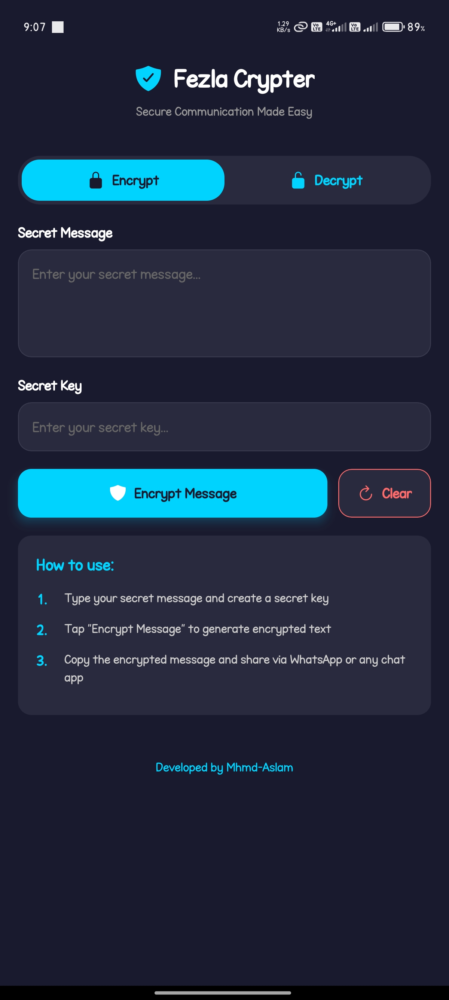
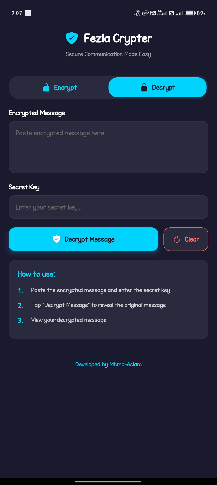

# Fezla Crypter 🔐

Fezla Crypter is a secure communication app for Android and iOS that allows users to **encrypt and decrypt messages using AES encryption**. Built with **React Native**, **Expo**, and **TypeScript**, it offers a simple and secure way to protect your messages.

---

## 📲 Download APK

👉 [Click here to download the APK](https://github.com/Mhmd-Aslam/Fezla-Crypter/raw/main/bin/fezlacrypter-2.0-sdk.apk)


## 🚀 Features

- 🔐 **AES Encryption**: Uses industry-standard AES algorithm for message security.
- 📱 **Cross-Platform**: Compatible with both Android and iOS devices.
- 🧠 **Simple Interface**: Easy to use, no technical background required.
- 📋 **Copy to Clipboard**: Quickly copy encrypted messages.
- 🔗 **Secure Sharing**: Share via WhatsApp, Telegram, or any messaging app.

---

## 🛠️ How It Works

1. **Encryption**  
   - User A enters a secret message and a key.  
   - The app encrypts the message using AES and outputs ciphertext.

2. **Sharing**  
   - User A copies the ciphertext and shares it via any chat app.

3. **Decryption**  
   - User B pastes the ciphertext and enters the same key.  
   - The app decrypts the message and displays the original content.

---

## 📦 Installation

```bash
# Clone the repository
git clone https://github.com/Mhmd-Aslam/fezla-crypter.git
cd fezla-crypter

# Install dependencies
npm install

# Start development server
npm start

# Run on Android device/emulator
npm run android

# Run on iOS simulator (Mac only)
npm run ios
```

## 🧰 Tech Stack

- **React Native**  
- **Expo**  
- **TypeScript**  
- **React Native Crypto JS**  
- **Expo Clipboard**  
- **Expo Haptics**  
- **Expo Router**

---

## 🔒 Security Features

- ✅ AES-256 encryption algorithm  
- ✅ No local data storage  
- ✅ Secure key handling (user-controlled)  
- ✅ Real-time encryption/decryption

---

## 📱 Usage

### 🔐 Encryption

1. Switch to the **"Encrypt"** tab.  
2. Enter your secret message.  
3. Enter a secret key.  
4. Tap **"Encrypt Message"**.  
5. Copy the result and share it.

### 🔓 Decryption

1. Switch to the **"Decrypt"** tab.  
2. Paste the encrypted message.  
3. Enter the same secret key.  
4. Tap **"Decrypt Message"** to reveal the original.

---

## 🧑‍💻 Development

This project uses:

- **Expo Router** for navigation  
- **TypeScript** for strong typing and safer development

To reset the project:

```bash
npm run reset-project

```

## 🤝 Contributing

We welcome contributions!  
Please open an issue or submit a pull request to help improve this app.

---


## 📷 Screenshots

<p align="left">
  
  
</p>


---

## 📄 License

This project is licensed under the **MIT License**.

---
