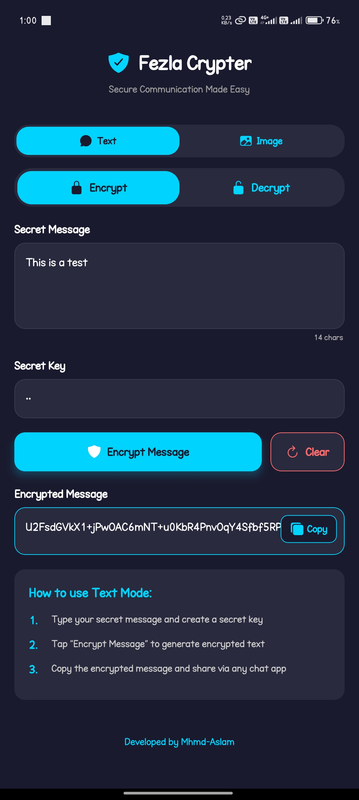
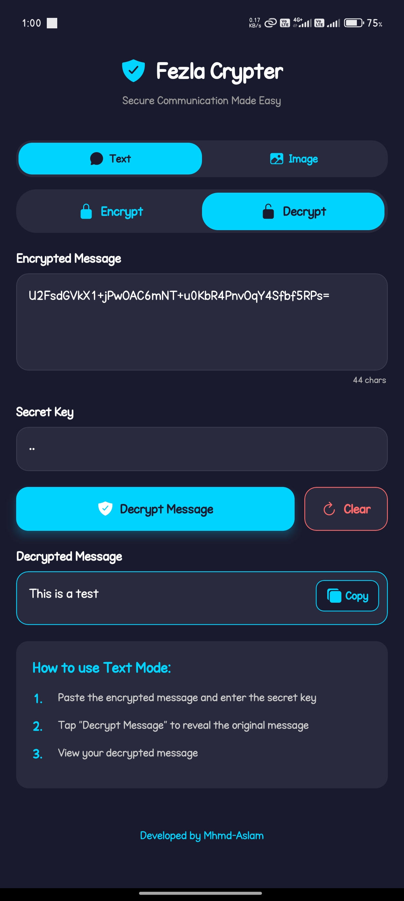
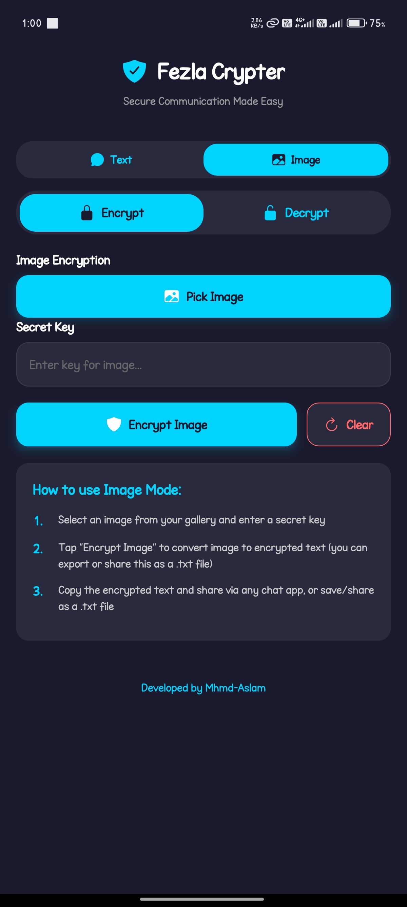
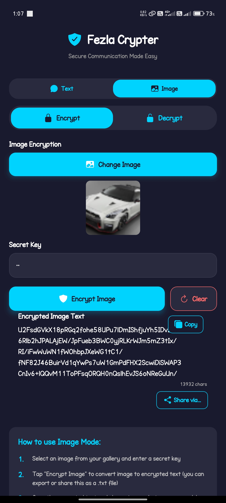

# Fezla Crypter 🔐

A **high-performance secure communication app** for Android and iOS that encrypts text messages and images using AES-256 encryption with **multithreaded processing** for seamless performance.

---

## 📲 Download APK

👉 [Download Latest APK](https://github.com/Mhmd-Aslam/Fezla-Crypter/releases/download/v3.2.8/fezlacrypter-3.2.8-sdk.apk)

---

## 🚀 Features

- 🔐 **AES-256 Encryption** for text and images
- 🧵 **Multithreaded Processing** - better performance
- 📱 **Cross-Platform** - Android & iOS
- 📋 **Copy & Share** encrypted data
- 💾 **Export/Import** encrypted files
- 🎯 **Smart Chunking** for large files
- 🔒 **No Local Storage** - privacy first

---

## 🛠️ Installation

```bash
git clone https://github.com/Mhmd-Aslam/fezla-crypter.git
cd fezla-crypter
npm install
npm run postinstall
npm start
```

---

## 📱 Usage

### **Text Encryption**

1. Enter message and key
2. Tap "Encrypt Message"
3. Copy and share

### **Image Encryption**

1. Pick image from gallery/camera
2. Enter encryption key
3. Tap "Encrypt Image"
4. Share encrypted data

### **Decryption**

1. Paste encrypted data
2. Enter same key
3. Tap "Decrypt" to reveal

---

## 🧰 Tech Stack

- **React Native 0.79.5** + **Expo SDK 53**
- **TypeScript** + **ESLint**
- **react-native-multithreading** for background processing
- **react-native-crypto-js** + **react-native-quick-crypto**

---

## 🔒 Security

- ✅ **AES-256-CBC** encryption
- ✅ **User-controlled keys** only
- ✅ **No data persistence**
- ✅ **Memory-safe operations**

---

## 📷 Screenshots

<p align="left">
  
  
  
  
  
  
</p>

---

## 🤝 Contributing

1. Fork the repository
2. Create feature branch
3. Make changes
4. Submit pull request

---

## 📄 License

MIT License

---

## 🔄 Version History

- **v3.2.1**: Enhanced multithreading, image processing
- **v3.1.1**: Added image encryption
- **v2.0**: Initial release
